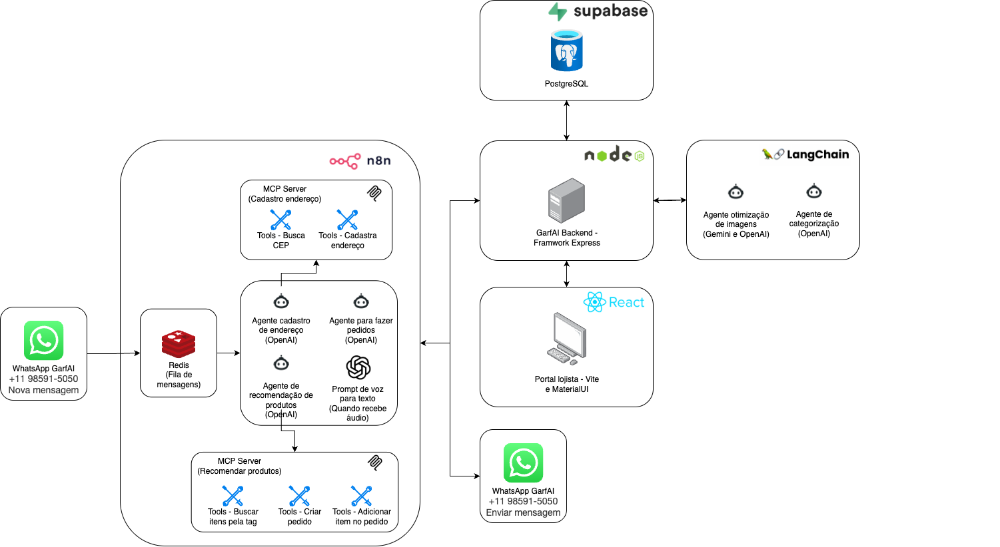

# 🍽️ GarfAI Backend 🤖

[](https://www.typescriptlang.org/)
[](https://nodejs.org/)
[](https://expressjs.com/)
[](https://www.postgresql.org/)
[](https://supabase.io/)
[](LICENSE)
[](https://adapta.org/hackathon)

## 🌟 Visão Geral

GarfAI é uma plataforma inovadora que utiliza Inteligência Artificial Generativa para transformar a experiência de gestão e interação com cardápios digitais. Desenvolvido para o [Adapta AI Challenge 2025](https://adapta.org/hackathon), o GarfAI resolve desafios reais do setor alimentício através de uma arquitetura robusta e escalável.

## 🖼️ Arquitetura do Projeto



O GarfAI Backend segue princípios SOLID e utiliza uma arquitetura modular:

```
garfai-be/
│── src/                  📂
│   │── agents/           # Agentes de IA 🤖
│   │── config/           # Configurações ⚙️
│   │── handlers/         # Manipuladores de rotas 🔗
│   │── middlewares/      # Middlewares Express 🔒
│   │── repositories/     # Acesso a dados 💾
│   │── schemas/          # Esquemas de banco de dados 📊
│   │── services/         # Serviços de negócio ✨
│   │── types/            # Definições de tipos 📝
│   │── use-cases/        # Casos de uso 📃
│   └── utils/            # Utilitários 🔧
│── drizzle.config.ts     # Configuração do Drizzle ORM 💧
└── index.ts              # Ponto de entrada da aplicação 🔥
```


## 🛠️ Stack Tecnológica

- **Backend**: TypeScript, Node.js, Express
- **Banco de Dados**: PostgreSQL com Supabase 🔄
- **ORM**: Drizzle 💧
- **Validação**: Yup ✅
- **Autenticação**: Passport.js (OAuth 2.0) 🔐
- **IA**: Integração com modelos de IA generativa para análise de imagens e categorização automática 🧠
- **Utilitários**: Lodash 🧰

## ✨ Funcionalidades Principais

### 1. 📋 Sistema de Gestão de Cardápios

- **Importação de Cardápios**: API para importação de cardápios de serviços terceiros 📥
- **Gerenciamento de Itens**: CRUD completo para itens de cardápio com suporte a categorias 🔄
- **Ambientes Múltiplos**: Suporte para múltiplos ambientes (restaurantes, estabelecimentos) 🏢

### 2. 🧠 Categorização Inteligente com IA

- **Auto-Tagging**: Categorização automática de itens do cardápio utilizando IA generativa 🏷️
- **Sistema de Tags Extensivo**: Mais de 100 tags pré-definidas cobrindo:
  - Culinárias regionais brasileiras (Nordestina, Mineira, Baiana, etc.)
  - Culinárias internacionais (Italiana 🇮🇹, Japonesa 🇯🇵, Mexicana 🇲🇽, etc.)
  - Categorias dietéticas (Vegetariano 🥦, Vegano 🌱, Sem Glúten 🍞❌, etc.)
  - Tipos de refeição (Café da manhã ☕, Almoço 🍲, Jantar 🍽️, etc.)
  - Bebidas 🍹, Sobremesas 🍰 e muito mais

### 3. 🔍 API de Filtragem Avançada

- **Filtragem por Tags**: Endpoint `/menu/items/by-tags` para busca de itens por múltiplas tags 🏷️
- **Validação Robusta**: Validação de parâmetros com Yup ✅
- **Paginação Eficiente**: Suporte a paginação com limites configuráveis 📄
- **Otimização de Banco**: Utiliza operadores de sobreposição de array do PostgreSQL (`&&`) para consultas eficientes ⚡

### 4. 📸 Agente de Processamento de Imagens de Alimentos

- **Análise de Imagens**: Processamento assíncrono de imagens de alimentos 🧁
- **Descrições Enriquecidas**: Geração automática de descrições detalhadas para itens do cardápio 📝
- **Níveis de Análise**: Suporte para diferentes profundidades de análise (básica, detalhada, abrangente) 🔎
- **Estilos de Geração**: Personalização do estilo de descrições geradas 🎨

### 5. 💳 Sistema de Pedidos

- **Gestão de Pedidos**: API completa para criação e gerenciamento de pedidos 📃
- **Adição de Itens**: Funcionalidade para adicionar itens a pedidos existentes ➕
- **Integração com Cardápio**: Vinculação direta com o sistema de cardápios 🔗

## 💻 Endpoints da API

### 🍽️ Gestão de Cardápios
- `GET /menu`: Listar todos os cardápios de um ambiente 📓
- `GET /menu/:id`: Obter cardápio por ID 🔍
- `GET /menu/environment/:environmentId`: Obter cardápio por ID de ambiente 🏢
- `POST /menu/import`: Importar cardápio de serviço terceiro 📥

### 🍲 Gestão de Itens
- `GET /menu/item/:id`: Obter item por ID 🔍
- `GET /menu/items/by-tags`: Listar itens filtrados por tags 🏷️
- `PUT /menu/item/:id/image`: Atualizar imagem de um item 📷

### 🧠 Agente de Processamento de Imagens
- `POST /agents/food-image`: Processar imagem de alimento com IA 📸
- `GET /agents/food-image/job/:jobId`: Obter status de processamento de imagem ⏳
- `GET /agents/food-image/item/:itemId/jobs`: Listar todos os jobs de processamento para um item 📁
- `GET /agents/food-image/item/:itemId/latest`: Obter o job mais recente para um item ⏬

## ⚙️ Configuração e Instalação

### 📍 Pré-requisitos
- Node.js LTS 🐎
- PostgreSQL 🐘

### 💾 Instalação

```bash
# 💾 Clonar o repositório
git clone https://github.com/seu-usuario/garfai-be.git
cd garfai-be

# 📚 Instalar dependências
npm install

# 🔑 Configurar variáveis de ambiente
cp .env.example .env
# Editar .env com suas credenciais

# 🚀 Iniciar servidor de desenvolvimento
npm run dev
```

📍 O servidor estará disponível em http://localhost:4000

## 🏆 Contribuição para o Hackathon Adapta

[](https://adapta.org/hackathon)

Este projeto foi desenvolvido como parte do Adapta AI Challenge 2025, focando no desafio de Além do chat com IA Generativa 🤖. O GarfAI demonstra como a IA generativa pode transformar processos tradicionais do setor alimentício, criando experiências mais ricas e eficientes tanto para gestores quanto para clientes 🍽️✨.
